「Rによるデータ解析入門」アンケート結果解析
================
ニッタ ジョエル
2021-06-17

## はじめに

これは[「Rによるデータ解析入門」](https://swcarpentry-ja.github.io/2021-04-02-todai-online-ja/)ワークショップのアンケート調査の結果です。

アンケートはワークショップの前と後、一回ずつ匿名で行いました。アンケートの内容はこちらです：

-   [ワークショップ前アンケート](https://github.com/swcarpentry-ja/assessment-archives/blob/master/pre-workshop/pre-workshop-ja.md)
-   [ワークショップ後アンケート](https://github.com/swcarpentry-ja/assessment-archives/blob/master/post-workshop/post-workshop-ja.md)

## ワークショップ前アンケート

ワークショップ前アンケートに13人が答えました。

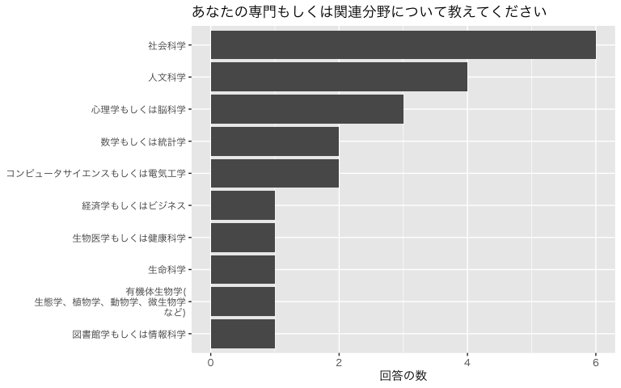<!-- -->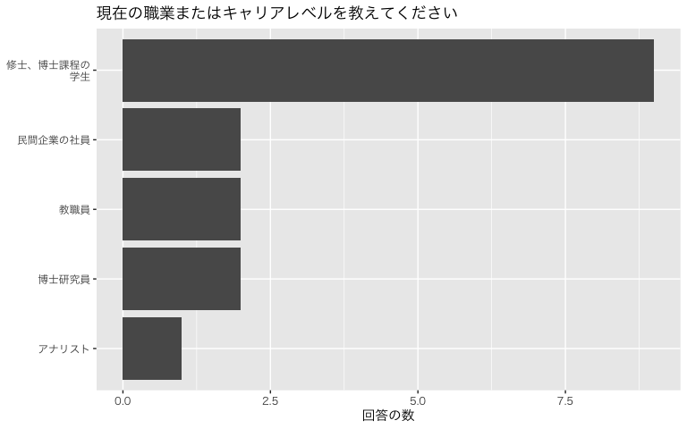<!-- -->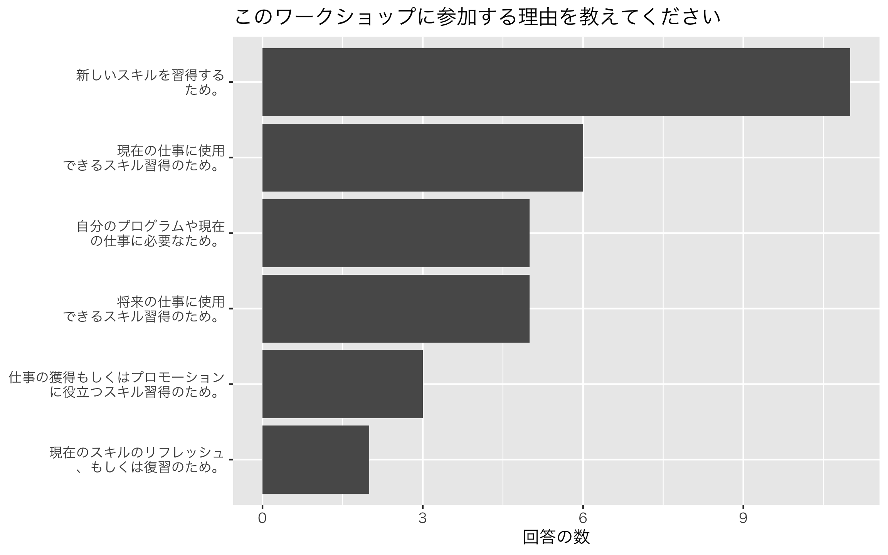<!-- -->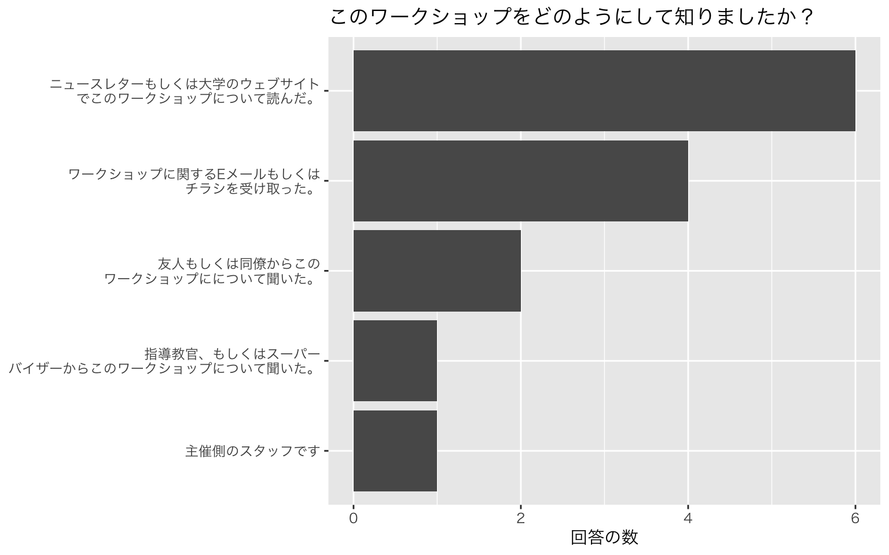<!-- -->

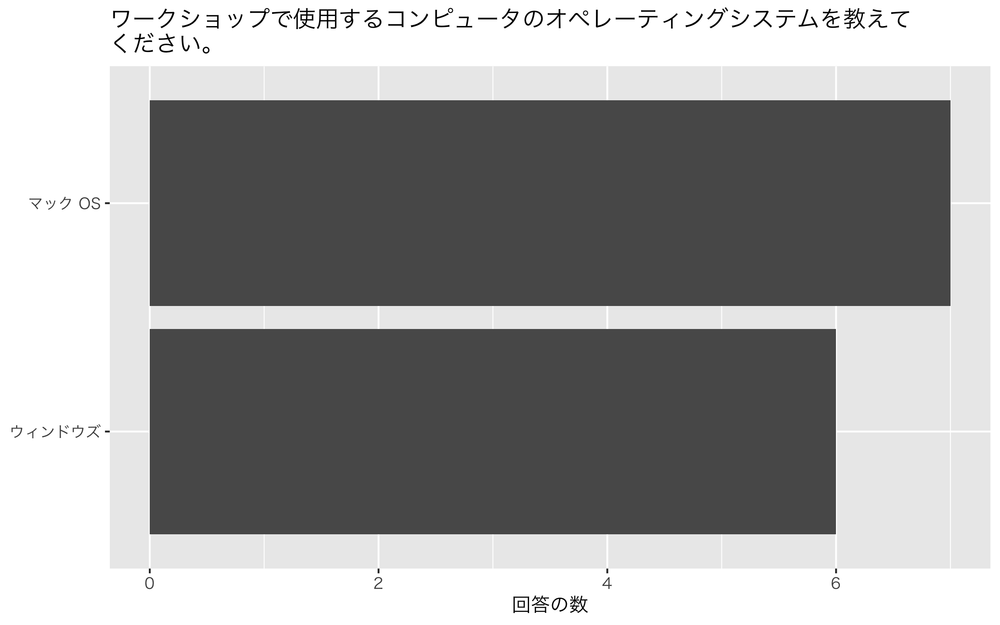<!-- -->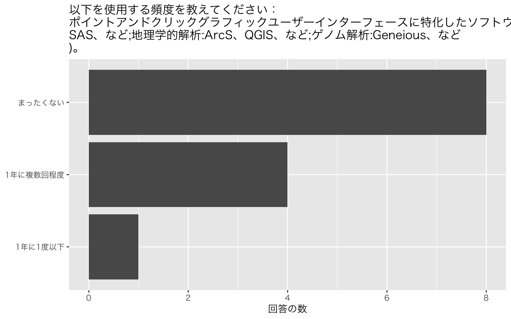<!-- -->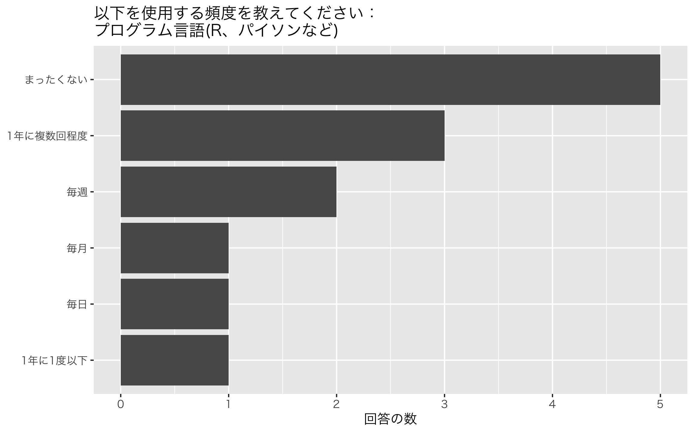<!-- -->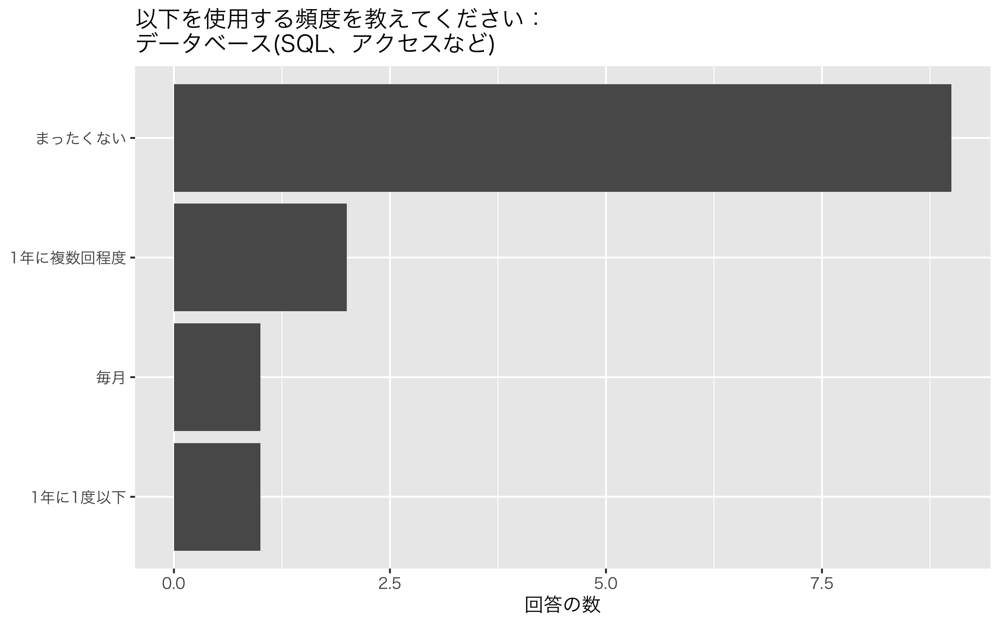<!-- -->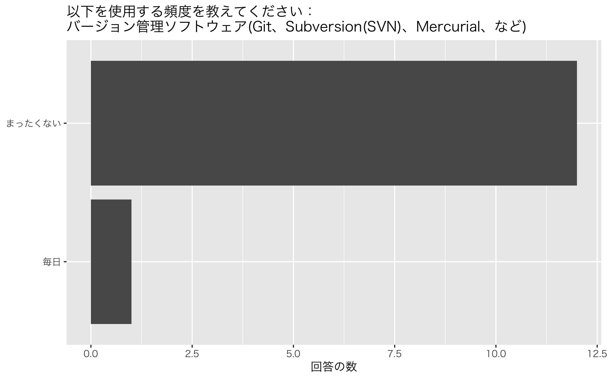<!-- -->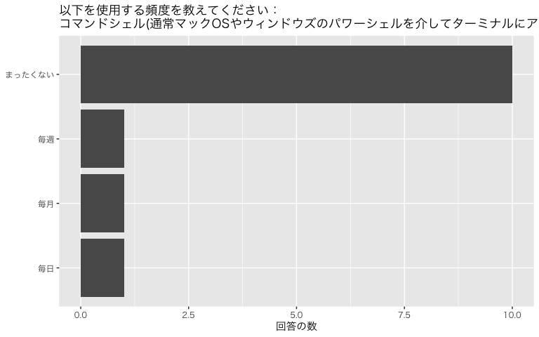<!-- -->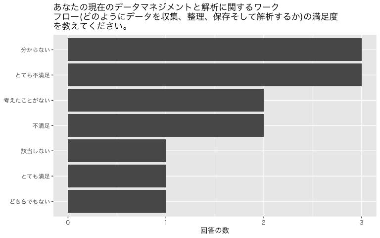<!-- -->

## ワークショップ後アンケート

ワークショップ後アンケートに8人が答えました。

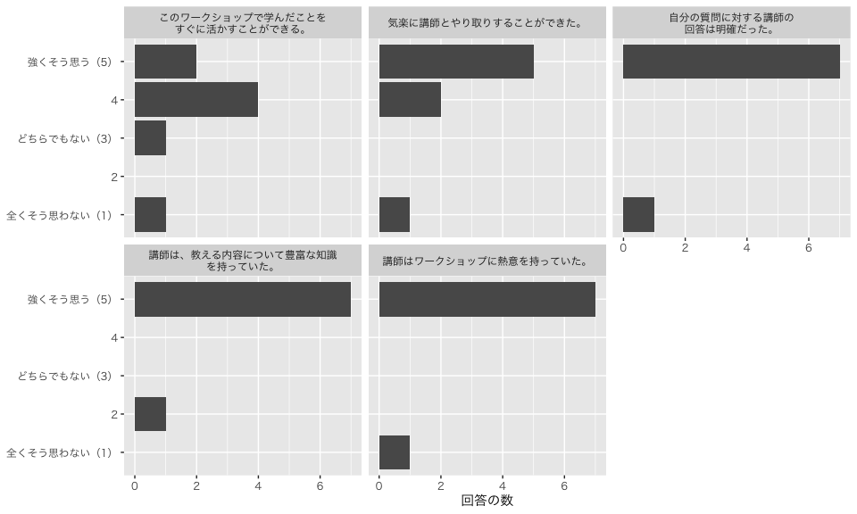<!-- -->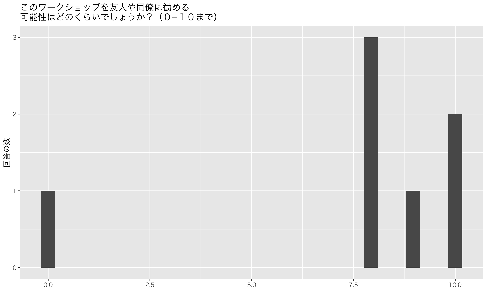<!-- -->

## ワークショップ前後の比較

前後のアンケートで共通にあった質問です。

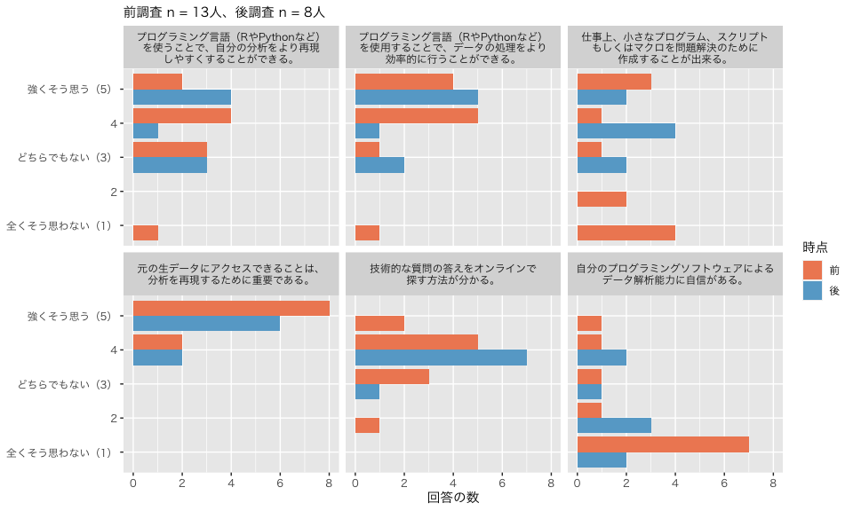<!-- -->
